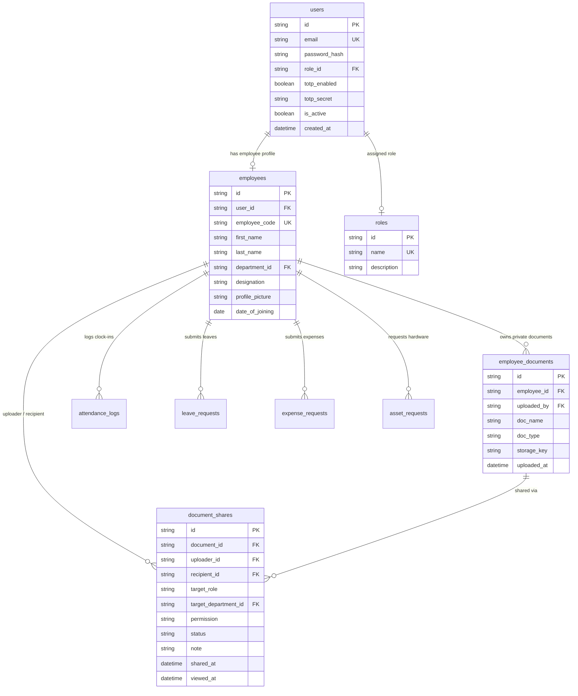

# Maxenius HRMS - Database Schema & ERD Documentation

## 1. Relational Entity Relationship Diagram (ERD)

---

## 2. Table Specifications

### 2.1 `users`
Stores user authentication identities, passhashes, role assignments, and 2FA secrets.
- `id` (VARCHAR(36), PK): UUID v4 primary key.
- `email` (VARCHAR(255), UNIQUE, NOT NULL): Work email address.
- `password_hash` (VARCHAR(255), NOT NULL): Werkzeug pbkdf2/sha256 password hash.
- `role_id` (VARCHAR(36), FK `roles.id`): Assigned RBAC role ID.
- `totp_enabled` (BOOLEAN, DEFAULT FALSE): 2FA activation status flag.
- `totp_secret` (VARCHAR(64), NULLABLE): PyOTP Base32 TOTP secret key.
- `is_active` (BOOLEAN, DEFAULT TRUE): Account active status.

### 2.2 `employees`
Stores employee personnel details, job title, department ID, and avatar URL.
- `id` (VARCHAR(36), PK): UUID v4 primary key.
- `user_id` (VARCHAR(36), FK `users.id`, UNIQUE): One-to-one user mapping.
- `employee_code` (VARCHAR(32), UNIQUE): Employee ID code (e.g. `EMP-1001`).
- `first_name` (VARCHAR(64), NOT NULL): Given name.
- `last_name` (VARCHAR(64), NOT NULL): Family name.
- `department_id` (VARCHAR(36), FK `departments.id`): Assigned department.
- `designation` (VARCHAR(128)): Job title.
- `profile_picture` (VARCHAR(255)): Uploaded avatar relative URL.

### 2.3 `employee_documents`
Stores document metadata for private ESS profile documents and team shared assets.
- `id` (VARCHAR(36), PK): UUID v4.
- `employee_id` (VARCHAR(36), FK `employees.id`): Associated employee record.
- `uploaded_by` (VARCHAR(36), FK `users.id`): User who uploaded the binary file.
- `doc_name` (VARCHAR(255)): File display title.
- `doc_type` (VARCHAR(64)): Category tag (`HANDOVER`, `MEDICAL`, `CONTRACT`, `PERSONAL`).
- `storage_key` (TEXT): Encoded JSON payload or storage directory file path (`/uploads/documents/doc_123.pdf`).

### 2.4 `document_shares`
Manages cross-user file sharing permissions, target roles/departments, and read receipt tracking.
- `id` (VARCHAR(36), PK): UUID v4.
- `document_id` (VARCHAR(36), FK `employee_documents.id`): Shared file ID.
- `uploader_id` (VARCHAR(36), FK `users.id`): User who initiated the share.
- `recipient_id` (VARCHAR(36), FK `users.id`, NULLABLE): Individual recipient user ID.
- `target_role` (VARCHAR(64), NULLABLE): Role broadcast target (`LINE_MANAGER`, `HR_ADMIN`, `ALL`).
- `permission` (VARCHAR(32), DEFAULT `VIEW`): Access level (`VIEW`, `DOWNLOAD`).
- `status` (VARCHAR(32), DEFAULT `PENDING`): Delivery status (`PENDING`, `ACKNOWLEDGED`, `REVOKED`).
- `shared_at` (DATETIME): Share timestamp.
- `viewed_at` (DATETIME, NULLABLE): Recipient read receipt timestamp.

### 2.5 `channels`
Workspace messaging channels (Group channels and 1-on-1 Direct Messages).
- `id` (VARCHAR(36), PK): UUID v4.
- `name` (VARCHAR(100), NULLABLE): Channel title (NULL for 1-on-1 DMs).
- `is_direct_message` (BOOLEAN, DEFAULT FALSE): 1-on-1 DM flag.
- `is_private` (BOOLEAN, DEFAULT FALSE): Private channel flag.
- `created_by` (VARCHAR(36), FK `users.id`): Channel creator.
- `created_at` (TIMESTAMP WITH TIME ZONE): Channel creation timestamp.

### 2.6 `channel_members`
Channel membership and role assignments.
- `channel_id` (VARCHAR(36), FK `channels.id`, PK): Channel ID.
- `user_id` (VARCHAR(36), FK `users.id`, PK): Member User ID.
- `role` (VARCHAR(20), DEFAULT `member`): Channel role (`admin`, `member`).
- `joined_at` (TIMESTAMP WITH TIME ZONE): Membership timestamp.

### 2.7 `messages`
Real-time chat messages, system alerts, and HR AI Bot responses.
- `id` (VARCHAR(36), PK): UUID v4.
- `channel_id` (VARCHAR(36), FK `channels.id`): Target channel ID.
- `sender_id` (VARCHAR(36), FK `users.id`, NULLABLE): Sender user ID (NULL for Bot).
- `sender_type` (VARCHAR(20), DEFAULT `user`): Entity type (`user`, `system`, `bot`).
- `content` (TEXT): Message markdown content.
- `is_edited` (BOOLEAN, DEFAULT FALSE): Edit flag.
- `created_at` (TIMESTAMP WITH TIME ZONE): Index `(channel_id, created_at)`.

### 2.8 `attachments`
Document metadata for secure pre-signed file sharing via S3 / MinIO.
- `id` (VARCHAR(36), PK): UUID v4.
- `message_id` (VARCHAR(36), FK `messages.id`): Parent message ID.
- `file_name` (VARCHAR(255)): File display title.
- `file_size_bytes` (BIGINT): File byte size.
- `mime_type` (VARCHAR(100)): Whitelisted MIME type.
- `storage_path` (TEXT): Object storage path (`channels/<ch_id>/<timestamp>_<file>`).
- `uploaded_by` (VARCHAR(36), FK `users.id`): Uploader user ID.

### 2.9 `hr_policy_chunks`
Vector store for RAG HR policy document chunks and vector embeddings.
- `id` (VARCHAR(36), PK): UUID v4.
- `title` (VARCHAR(255)): Policy title.
- `category` (VARCHAR(100)): Policy category (`Leave Policy`, `Employee Benefits`, etc.).
- `content` (TEXT): Text chunk content.
- `embedding` (JSON): Normalized vector embedding array for pgvector / cosine similarity retrieval.

