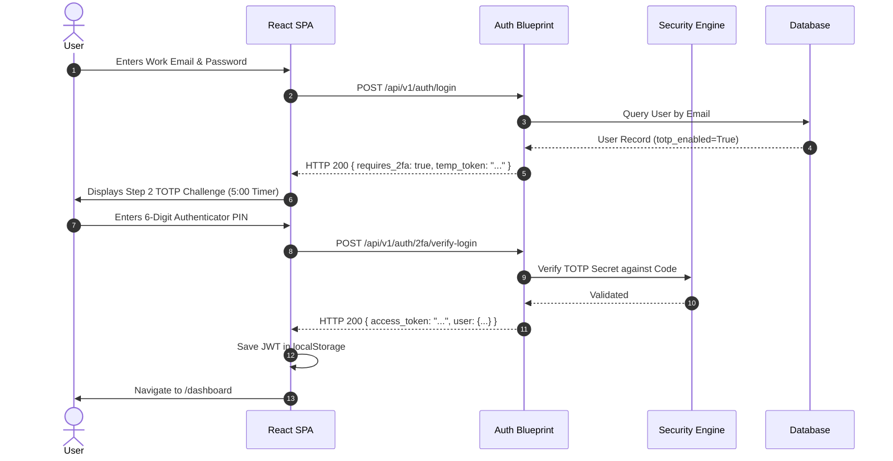
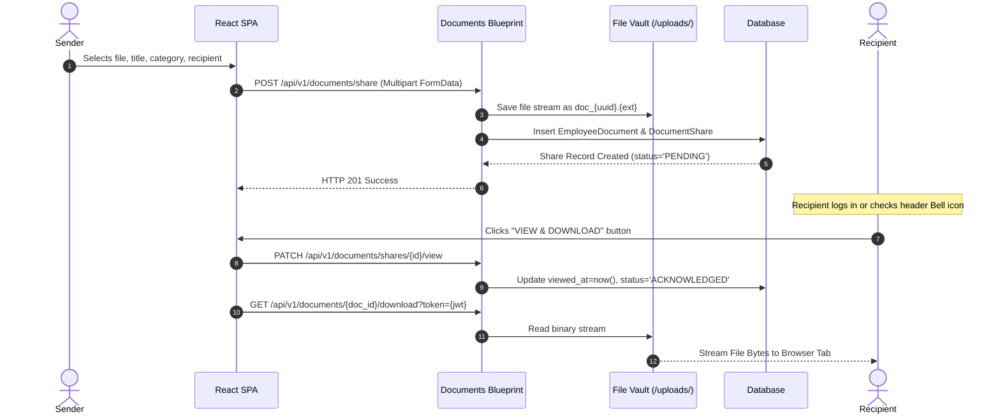

# Maxenius HRMS - End-to-End System Workflows

## 1. Authentication & 2FA Lifecycle Flow

---

## 2. Document Upload & Cross-User Sharing Flow

---

## 3. Real-Time Notification & Read-State Synchronization Flow
1. **Trigger Event**: Uploader shares document or employee submits leave request.
2. **Database Write**: `DocumentShare` or `LeaveRequest` record inserted into database.
3. **Notification Polling / Fetch**: Frontend `DashboardLayout.tsx` calls `GET /api/v1/notifications` on layout mount or periodic intervals.
4. **Dynamic Aggregation**: Backend queries unviewed items where `viewed_at is Null` and recipient matches current user identity or role.
5. **Badge Render**: Header Bell icon displays red/teal unread dot or badge count (`unreadCount > 0`).
6. **State Sync**: Clicking document notification navigates to `/documents` and marks item as viewed upon download.

---

## 4. Profile Avatar Upload & Global Cache Update Flow
1. **File Selection**: User selects profile photo on `/profile`.
2. **Upload**: Client sends `POST /api/v1/employees/<emp_id>/avatar` with file payload.
3. **Sanitization**: Backend validates MIME type (`image/jpeg`, `image/png`), resizes image if needed, and saves file to `uploads/avatars/avatar_<uuid>.jpg`.
4. **State Refresh**: Backend returns updated relative URL `/uploads/avatars/avatar_<uuid>.jpg`.
5. **Global Sync**: React updates Zustand `authStore` user object and broadcasts avatar update to `DashboardLayout.tsx` header immediately.
